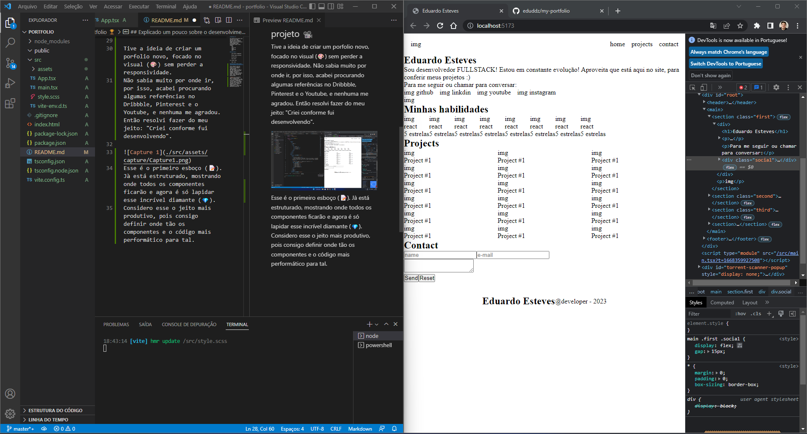

# Portfolio 🏆

Estou desenvolvendo esse site para mostrar meus projetos, falar sobre mim e as experiências ao longo da carreira.
O portfolio utiliza as tecnologias mais modernas do mercado de trabalho, como por exemplo: 

    🟥 React
    🟦 Typescript
    🟨 Sass
    ⬜ Entre outras libs.

## Code 👨🏻‍💻

    npm install vite@latest
    |
    project name: portfolio
    |
    cd portfolio
    |
    npm install

For install sass

    npm i sass

## Explicado um pouco sobre o desenvolvimento do projeto 📽️

Tive a ideia de criar um porfolio novo, focado no visual (🎨) sem perder a responsividade.
Não sabia muito por onde ir, por isso, acabei procurando algumas referências no Dribbble, Pinterest e o Youtube, e nenhuma me agradou. Então resolvi fazer do meu jeito: "Criei conforme fui desenvolvendo".

Esse é o primeiro esboço (📝). Jà está estruturado, mostrando onde todos os componentes ficarão e agora é só lapidar esse incrível diamante (💎). 
Considero esse o jeito mais produtivo, pois consigo definir onde tão os componentes e o código mais performático para tal.